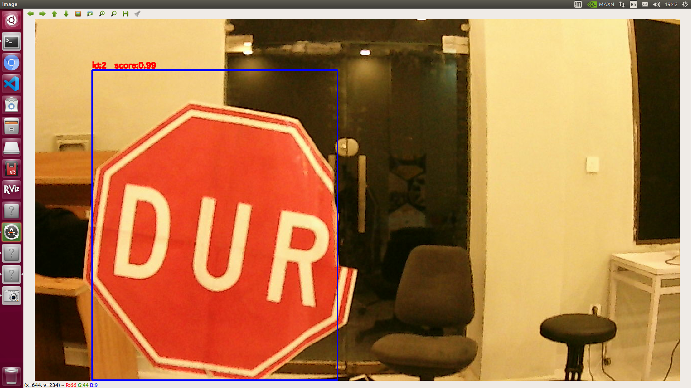

# Lane Assistance and Yolo TensorRT Implementation





## INTRODUCTION

This is implementation of yolo with tensorrt inference. Model is trained on custom dataset for traffic light and signs and it is converted into tensorrt.
For custom weights
You can download the weights from [here](https://drive.google.com/file/d/15nYbuOBKZOzV1vgfJg0BxAlFs4H3DKKE/view?usp=sharing) and extract it at detection-trt/configs
For object yolov4 python object detection 
You can download the weights from [here](https://drive.google.com/file/d/1nNhS6VZmRGZN_uMCZdX7R7aQRhV8ksul/view?usp=sharing) and extract it at detection-trt/python/yolo


```bash
git clone https://github.com/king-ali/VISION-TAG.git
cd VISION-TAG/
cd detection-trt/
mkdir build
cd build/
cmake ..
make
./yolo-trt
```

Open terminal
Run command

```bash
roslaunch usb_cam usb_cam-test.launch
```
On ubuntu press ctr+shift+T it will open new terminal then run

## For Traffic sign


```bash
rosrun yolo-trt sample
```

## For Traffic light

```bash
rosrun yolo-trt signal
```

## For Object detection YOLOV4 Python

```bash
cd ${HOME}/VISION-TAG/detection-trt/python/
./install_pycuda.sh
```


```bash
cd ${HOME}/VISION-TAG/detection-trt/python/
sudo pip3 install onnx==1.9.0
```


```bash
cd ${HOME}/VISION-TAG/detection-trt/python/plugins
make
```

RUN

```bash
cd ${HOME}/VISION-TAG/detection-trt/python/
python3 yolo-trt -m yolov4-416
```


or 
To download pretrained model 

```bash
cd ${HOME}/VISION-TAG/detection-trt/python/yolo
./download_yolo.sh
python3 yolo_to_onnx.py -m yolov4-416
python3 onnx_to_tensorrt.py -m yolov4-416
```


## For Lane detection

```bash
cd ${HOME}/VISION-TAG/lane detection/
python3 lane_finder.py
```


## REFERENCE

- https://github.com/wang-xinyu/tensorrtx/tree/master/yolov4
- https://github.com/jkjung-avt/tensorrt_demos
- https://github.com/enazoe/yolo-tensorrt
- https://github.com/OanaGaskey/Advanced-Lane-Detection
- https://github.com/mj8ac/trt-yolo-app_win64
- https://github.com/NVIDIA-AI-IOT/deepstream_reference_apps
