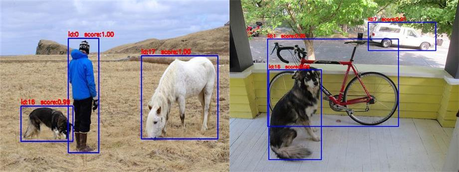

# Yolo TensorRT Implementation




## INTRODUCTION

This is implementation of yolo with tensorrt inference. Model is trained on custom dataset of traffic light and signs and it is converted into tensorrt.

## Traffic sign and light detection
You can download the weights from here
Extract these weights at configs folder
open terminal 


```bash
rosrun yolo-trt sample
```


## PLATFORM & BENCHMARK

- [x] windows 10
- [x] ubuntu 18.04
- [x] L4T (Jetson platform)

<details><summary><b>BENCHMARK</b></summary>

#### x86 (inference time)


|  model  |  size   |  gpu   | fp32 | fp16 | INT8 |
| :-----: | :-----: | :----: | :--: | :--: | :--: |
| yolov5s | 640x640 | 1080ti | 8ms  |  /   | 7ms  |
| yolov5m | 640x640 | 1080ti | 13ms |  /   | 11ms |
| yolov5l | 640x640 | 1080ti | 20ms |  /   | 15ms |
| yolov5x | 640x640 | 1080ti | 30ms |  /   | 23ms |
#### Jetson NX with Jetpack4.4.1 (inference / detect time)

|      model      |      size      |  gpu   | fp32 | fp16 | INT8 |
| :-------------: | :----: | :--: | :--: | :--: | :--: |
| yolov3 | 416x416 | nx | 105ms/120ms |  30ms/48ms  | 20ms/35ms |
| yolov3-tiny | 416x416 | nx | 14ms/23ms  |  8ms/15ms   | 12ms/19ms  |
| yolov4-tiny | 416x416 | nx | 13ms/23ms  |  7ms/16ms   | 7ms/15ms  |
| yolov4 | 416x416 | nx | 111ms/125ms  |  55ms/65ms  | 47ms/57ms  |
| yolov5s | 416x416 | nx | 47ms/88ms |  33ms/74ms   | 28ms/64ms |
|   yolov5m   | 416x416 | nx | 110ms/145ms |  63ms/101ms   | 49ms/91ms |
| yolov5l | 416x416 | nx | 205ms/242ms |  95ms/123ms   | 76ms/118ms |
| yolov5x | 416x416 | nx | 351ms/405ms |  151ms/183ms   | 114ms/149ms |


### ubuntu 
|      model      |      size      |  gpu   | fp32 | fp16 | INT8 |
| :-------------: | :----: | :--: | :--: | :--: | :--: |
| yolov4 | 416x416 | titanv | 11ms/17ms  |  8ms/15ms  | 7ms/14ms  |
| yolov5s | 416x416 | titanv | 7ms/22ms |  5ms/20ms   | 5ms/18ms |
|   yolov5m   | 416x416 | titanv | 9ms/23ms |  8ms/22ms   | 7ms/21ms |
| yolov5l | 416x416 | titanv | 17ms/28ms |  11ms/23ms   | 11ms/24ms |
| yolov5x | 416x416 | titanv | 25ms/40ms |  15ms/27ms   | 15ms/27ms |
</details>

## WRAPPER

Prepare the pretrained __.weights__ and __.cfg__ model. 

```c++
Detector detector;
Config config;

std::vector<BatchResult> res;
detector.detect(vec_image, res)
```

## Build and use yolo-trt as DLL or SO libraries


### windows10

- dependency : TensorRT 7.1.3.4  , cuda 11.0 , cudnn 8.0  , opencv4 , vs2015
- build:
  
    open MSVC _sln/sln.sln_ file 
    - dll project : the trt yolo detector dll
    - demo project : test of the dll

### ubuntu & L4T (jetson)

The project generate the __libdetector.so__ lib, and the sample code.
**_If you want to use the libdetector.so lib in your own project,this [cmake file](https://github.com/enazoe/yolo-tensorrt/blob/master/scripts/CMakeLists.txt) perhaps could help you ._**


```bash
git clone https://github.com/king-ali/VISION-TAG.git
cd VISION-TAG/
cd detection-trt/
mkdir build
cd build/
cmake ..
make
./yolo-trt
```

## REFERENCE

- https://github.com/wang-xinyu/tensorrtx/tree/master/yolov4
- https://github.com/mj8ac/trt-yolo-app_win64
- https://github.com/NVIDIA-AI-IOT/deepstream_reference_apps

## Contact

